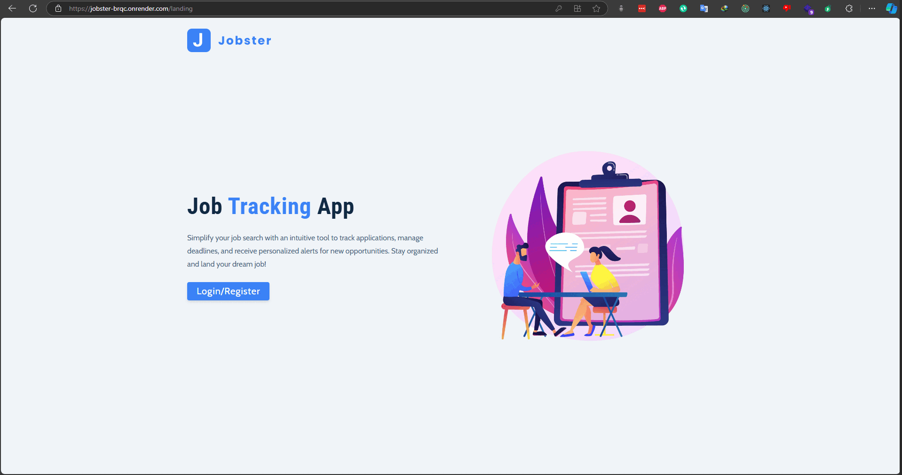

# Jobster🗺️

🚀 [Live Version](https://jobster-brqc.onrender.com/ "Whatsapp"): https://jobster-brqc.onrender.com/

---

📃 Description:

    Jobster is a simple application for tracking user job applications to various companies and updating job statuses over time. Users can add, update, delete, and filter job applications.

---

⚙️ Technologies:

    Frontend: HTML, CSS, JavaScript, React, Redux
    Backend: Node.js, ExpressJS
    Database: MongoDB

---

📷 Screen Shots:

